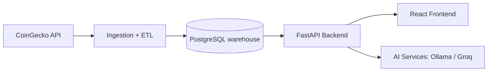

# CryptoMarketWarehouse

CryptoMarketWarehouse is a cryptocurrency data warehouse and analytics platform developed as a
university Data Warehousing project. A PostgreSQL warehouse is fed CoinGecko market data through
ETL pipelines, a FastAPI backend exposes analytics and application APIs, and a React frontend
provides dashboards, portfolio tracking, paper trading, and AI-assisted market insights.

## Main Features

- **Market dashboard** — current market overview, top market-cap and top-volume coins, and
  coin detail pages with historical and intraday charts.
- **Market leaders** — gainers, losers, and volatility highlights over Today, 7D, 30D, 90D,
  and 1Y windows.
- **Analytics Explorer** — custom historical queries over warehouse data with CSV export.
- **Portfolio tracking** — manual holdings with cost basis, valuation, and profit/loss.
- **Paper trading** — a simulated cash account with buy/sell transactions and transaction
  history.
- **AI insights** — market summaries, per-coin analysis, and portfolio reviews generated from
  deterministic warehouse metrics, using local Ollama or the Groq API.
- **English and Macedonian localization** with Light, Dark, and System themes.

## Technology Stack

- **Frontend:** React 19, TypeScript, Vite, React Router, Recharts, `react-i18next`
- **Backend:** Python, FastAPI, Uvicorn, `psycopg` 3, APScheduler
- **Database:** PostgreSQL 16 (Docker Compose) with `staging`, `dw`, `analytics`, `audit`,
  and `app` schemas
- **Data:** CoinGecko market data — current snapshots, historical backfill, and intraday charts
- **AI:** Interchangeable Ollama / Groq providers behind a shared abstraction

## Architecture



CoinGecko data lands in staging tables, ETL loads it into a dimensional warehouse (date and
SCD Type 2 coin dimensions, daily and intraday fact tables), and analytics views feed the
backend. The frontend and AI features consume only backend APIs — nothing calls CoinGecko
directly.

## Installation and Running

Prerequisites: Python 3, Node.js, and Docker Desktop.

The dashboard, analytics, portfolio, and paper-trading features all work without any AI setup.
AI insights are optional and require a provider: either [Ollama](https://ollama.com/) running
locally (free, no key needed) or a [Groq](https://groq.com/) API key (Groq's free tier is
usually enough for this project). Set `AI_PROVIDER` and the matching variables in `.env` — see
`.env.example` for the available options. Only Ollama and Groq are implemented out of the box;
using Gemini, OpenAI, or another provider would require adding a new provider module following
the pattern in `ai/groq_provider.py`.

```powershell
# 1. Clone and configure
git clone https://github.com/oxSTERBENxo/CryptoMarketWarehouse.git
cd CryptoMarketWarehouse
Copy-Item .env.example .env
Copy-Item frontend\.env.example frontend\.env

# 2. Start PostgreSQL
docker-compose up -d

# 3. Set up the backend
python -m venv .venv
.venv\Scripts\python -m pip install -r requirements.txt

# 4. Apply migrations and load market data
.venv\Scripts\python -m database.bootstrap_db
.venv\Scripts\python -m etl.ingest_market_data
.venv\Scripts\python -m etl.load_warehouse

# 5. Run the backend (http://localhost:8000, API docs at /docs)
.venv\Scripts\python -m uvicorn main:app --reload --port 8000

# 6. Run the frontend (http://localhost:5173) — in a second terminal
cd frontend
npm install
npm run dev
```

On macOS/Linux, activate the virtual environment with `source .venv/bin/activate` and run the
same `python -m ...` commands without the `.venv\Scripts\` prefix.

## Demo Video

[Watch the CryptoMarketWarehouse demo on YouTube](https://youtu.be/DnljQKOUenw)

## Additional Documentation

Detailed documentation is available in [`explanations/`](explanations/), including
[`ARCHITECTURE.md`](explanations/ARCHITECTURE.md),
[`DATA_WAREHOUSE_MODEL.md`](explanations/DATA_WAREHOUSE_MODEL.md),
[`ETL_GUIDE.md`](explanations/ETL_GUIDE.md),
[`API.md`](explanations/API.md),
[`AI_FEATURES.md`](explanations/AI_FEATURES.md), and
[`LOCAL_DEVELOPMENT.md`](explanations/LOCAL_DEVELOPMENT.md).

## License

No license file is currently included. This project was developed for a university course and
is intended for educational use.
