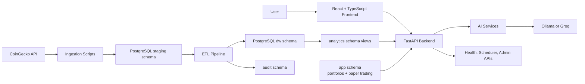

# CryptoMarketWarehouse

CryptoMarketWarehouse is a cryptocurrency data warehouse and analytics platform developed as a
university Data Warehousing project. It combines a PostgreSQL dimensional model, ETL pipelines
for historical and incremental market data, data-quality checks, analytics dashboards, portfolio
tracking, paper trading, and AI-assisted market insights in a single full-stack application.

The system is built around a PostgreSQL warehouse fed by CoinGecko market data, a FastAPI backend
that exposes analytics and application APIs, and a React frontend for exploring market trends,
portfolio performance, and AI-generated summaries. Application features never call CoinGecko
directly — all data flows through the warehouse and the backend API.

## Features

- **Market dashboard** — current market overview, latest snapshot data, top market-cap and
  top-volume coins, and manual market-data refresh.
- **Coin detail pages** — historical daily charts, today's intraday chart, price/volume
  summaries, and direct navigation from coin rows across the app.
- **Market leaders and movers** — gainers, losers, highest-volume and highest-ranked coins,
  volatility highlights, and coverage information over Today, 7D, 30D, 90D, and 1Y windows.
- **Analytics Explorer** — custom historical queries over warehouse data with date presets,
  explicit date ranges, optional filters, recent query state, and CSV export.
- **Portfolio management** — manual tracking of holdings, cost basis, current valuation,
  unrealized profit/loss, and portfolio-level totals.
- **Paper trading** — a simulated cash account with buy/sell transactions, weighted-average
  cost, transaction history, realized/unrealized profit/loss, and reset support.
- **Portfolio health and achievements** — deterministic metrics for diversification,
  concentration, allocation, and simulated trading progress.
- **AI insights** — an AI Market Summary, per-coin AI Coin Analysis, and AI Portfolio Review
  that interpret deterministic, warehouse-computed metrics as short structured commentary.
- **Localization and theming** — English and Macedonian interfaces via `react-i18next`, with
  Light, Dark, and System themes persisted in the browser.
- **Operations tooling** — warehouse health checks, scheduler status, ETL monitoring, startup
  recovery, and data-quality validation endpoints (see
  [Developer and Operations Tooling](#developer-and-operations-tooling)).

## Screenshots

No screenshots are committed to the repository yet. When they are added under
`docs/screenshots/`, they will be referenced here with standard Markdown image links.

## Technology Stack

**Frontend**

- React 19, TypeScript, and Vite
- React Router, Recharts
- `react-i18next` / `i18next` for localization
- `react-markdown` with `remark-gfm`
- Vitest, React Testing Library, and Oxlint

**Backend**

- Python with FastAPI and Uvicorn
- Pydantic models for request/response handling
- `psycopg` 3 for PostgreSQL access
- APScheduler for optional background data collection
- `python-dotenv` for environment configuration
- Pytest for tests

**Database**

- PostgreSQL 16 (via Docker Compose)
- SQL migrations under `db/`, organized into `staging`, `dw`, `audit`, `analytics`, and `app`
  schemas
- Dimensional model with `dw.dim_date`, an SCD Type 2 `dw.dim_coin`, daily market facts, and
  intraday market facts
- Application tables for manual portfolios and paper-trading transactions

**Data and AI**

- CoinGecko integration for current-market ingestion, historical daily backfill, and intraday
  market charts
- Incremental ETL from staging to the dimensional warehouse
- Interchangeable AI providers — local Ollama or the Groq API — behind a shared `AIProvider`
  abstraction, selected via environment variables

## Architecture

The application is split into a React frontend, a FastAPI backend, a PostgreSQL data warehouse,
ETL scripts, and provider-agnostic AI services.



### Warehouse Layers

| Schema | Purpose |
| --- | --- |
| `staging` | Raw/near-source CoinGecko rows loaded by ingestion scripts |
| `dw` | Dimensional warehouse tables and fact tables |
| `analytics` | Query-friendly views used by dashboards and APIs |
| `audit` | ETL run metadata and load status |
| `app` | Application data (portfolios, paper trading), kept separate from warehouse facts |

The data pipeline follows a traditional warehouse flow:

1. Ingestion scripts fetch CoinGecko market data into staging tables.
2. ETL loads validated data into the dimensional warehouse.
3. Analytics views expose query-friendly shapes for the backend.
4. The frontend and AI services consume only backend APIs.

Notable implementation details:

- `dw.dim_coin` uses SCD Type 2 behavior for coin attributes.
- Daily facts use a `(date_key, coin_key)` grain; intraday facts use timestamped observations
  in a separate fact table.
- ETL run metadata is recorded in `audit.etl_run`.
- Migrations, ingestion, and most load paths are designed to be idempotent.
- Startup recovery can detect missed daily dates and trigger non-blocking backfill work.

## Project Structure

```text
CryptoMarketWarehouse/
  ai/                 AI prompts, feature services, provider abstraction, Ollama/Groq providers
  analytics/          Analytics routes, repositories, and the Analytics Explorer workflow
  api/                Admin and operational API routes
  config/             Shared application configuration helpers
  database/           PostgreSQL connection handling and migration bootstrap
  db/                 SQL migrations grouped by schema
  etl/                Ingestion, intraday loading, historical backfill, and warehouse loading
  frontend/           React + TypeScript + Vite single-page application
  health/             Warehouse health and data-quality checks
  integrations/       CoinGecko API client
  paper_trading/      Simulated trading account and transaction logic
  portfolio/          Manual portfolio management
  services/           Scheduler, startup recovery, and pipeline orchestration
  tests/              Backend pytest suite
  explanations/       Detailed project documentation
  docker-compose.yml  Local PostgreSQL service
  main.py             FastAPI application entry point
```

## Installation and Setup

### Prerequisites

- Python 3 with virtual environment support
- Node.js and npm
- Docker Desktop (or another local PostgreSQL 16 instance)
- Optional: [Ollama](https://ollama.com/) for local AI features, or a Groq API key for hosted
  AI features

### 1. Clone the Repository

```bash
git clone <repository-url>
cd CryptoMarketWarehouse
```

### 2. Configure Environment Variables

Create the backend and frontend `.env` files from their examples:

```bash
# macOS/Linux
cp .env.example .env
cp frontend/.env.example frontend/.env
```

```powershell
# Windows PowerShell
Copy-Item .env.example .env
Copy-Item frontend\.env.example frontend\.env
```

Key backend variables:

```env
POSTGRES_HOST=localhost
POSTGRES_PORT=5432
POSTGRES_DB=crypto_market_warehouse
POSTGRES_USER=crypto
POSTGRES_PASSWORD=change_me

CORS_ALLOWED_ORIGINS=http://localhost:5173,http://127.0.0.1:5173

AI_PROVIDER=ollama
OLLAMA_BASE_URL=http://localhost:11434
OLLAMA_MODEL=llama3.1:8b

GROQ_API_KEY=
GROQ_MODEL=llama-3.3-70b-versatile
```

The frontend defaults to `VITE_API_BASE_URL=http://localhost:8000`. If port `8000` is
unavailable, run the backend on another port and update `frontend/.env` accordingly.

See [Environment Configuration](#environment-configuration) for the full variable reference.

### 3. Start PostgreSQL

```bash
docker-compose up -d
```

This starts a PostgreSQL 16 container named `cryptomarketwarehouse-postgres`.

### 4. Install Backend Dependencies

```powershell
# Windows PowerShell
python -m venv .venv
.venv\Scripts\python -m pip install -r requirements.txt
.venv\Scripts\python -m pip install -r requirements-dev.txt
```

```bash
# macOS/Linux
python -m venv .venv
source .venv/bin/activate
python -m pip install -r requirements.txt
python -m pip install -r requirements-dev.txt
```

On macOS/Linux, the remaining commands assume the virtual environment is activated. On Windows,
prefix them with `.venv\Scripts\` as shown above.

### 5. Apply Database Migrations

```bash
python -m database.bootstrap_db
```

The bootstrap process discovers SQL files under `db/`, applies migrations that have not yet run,
and records them in `public.schema_migrations`.

### 6. Load Market Data

Run a current-market ingestion followed by the warehouse load:

```bash
python -m etl.ingest_market_data
python -m etl.load_warehouse
```

Optional historical backfill and intraday loading (both are resumable and idempotent around the
warehouse constraints they write to):

```bash
python -m etl.backfill_market_history --help
python -m etl.ingest_intraday_market_data --help
```

### 7. Run the Backend

```bash
python -m uvicorn main:app --reload --port 8000
```

- API: `http://localhost:8000`
- Swagger/OpenAPI docs: `http://localhost:8000/docs`
- Health check: `http://localhost:8000/health`

### 8. Run the Frontend

```bash
cd frontend
npm install
npm run dev
```

The frontend is served at `http://localhost:5173`.

## Environment Configuration

### Backend Variables

| Variable | Purpose |
| --- | --- |
| `POSTGRES_HOST` | PostgreSQL host |
| `POSTGRES_PORT` | PostgreSQL port |
| `POSTGRES_DB` | Database name |
| `POSTGRES_USER` | Database user |
| `POSTGRES_PASSWORD` | Database password |
| `ENVIRONMENT` | Informational label displayed by warehouse health tooling |
| `APP_TIMEZONE` | Timezone authority for startup recovery and manual intraday timestamps |
| `CORS_ALLOWED_ORIGINS` | Comma-separated frontend origins allowed by FastAPI CORS |
| `PAPER_TRADING_INITIAL_CASH` | Initial simulated cash balance for paper trading |
| `ENABLE_SCHEDULER` | Enables scheduled daily market ingestion when `true` |
| `SCHEDULER_INTERVAL_MINUTES` | Interval between scheduled ingestion runs |
| `SCHEDULER_CURRENCY` | Currency used for scheduled/manual CoinGecko ingestion |
| `SCHEDULER_LIMIT` | Number of coins requested from CoinGecko |
| `SCHEDULER_ORDER` | CoinGecko ordering for market ingestion |
| `ENABLE_INTRADAY_SCHEDULER` | Enables the separate intraday ingestion scheduler when `true` |
| `INTRADAY_INTERVAL_MINUTES` | Interval between intraday ingestion runs |
| `INTRADAY_COINS` | Comma-separated CoinGecko coin IDs for intraday ingestion |
| `AI_PROVIDER` | Active AI provider: `ollama` or `groq` |
| `OLLAMA_BASE_URL` | Local Ollama server URL (`OLLAMA_URL` is a legacy alias) |
| `OLLAMA_MODEL` | Ollama model name |
| `OLLAMA_TIMEOUT_SECONDS` | Ollama request timeout |
| `GROQ_API_KEY` | Groq API key |
| `GROQ_MODEL` | Groq model name |
| `GROQ_TIMEOUT_SECONDS` | Groq request timeout |

### Frontend Variables

| Variable | Purpose |
| --- | --- |
| `VITE_API_BASE_URL` | FastAPI backend base URL used by the browser |

### Switching AI Providers

All AI features share the same provider abstraction; switching providers requires only
environment changes. The provider implementation is selected in `ai/config.py`, and
routes/services depend only on the `AIProvider` interface.

```env
# Local Ollama
AI_PROVIDER=ollama
OLLAMA_BASE_URL=http://localhost:11434
OLLAMA_MODEL=llama3.1:8b

# Groq
AI_PROVIDER=groq
GROQ_API_KEY=your_groq_api_key
GROQ_MODEL=llama-3.3-70b-versatile
```

## Usage

### Frontend Pages

| Route | Description |
| --- | --- |
| `/` | Dashboard with market overview, snapshot tables, refresh status, and AI Market Summary |
| `/coins/:symbol` | Coin details, history charts, intraday chart, and AI Coin Analysis |
| `/market-leaders` | Market movers over Today/7D/30D/90D/1Y |
| `/analytics-explorer` | Custom analytics query interface |
| `/portfolio` | Manual holdings, paper trading, and AI Portfolio Review |
| `/settings` | Theme and language settings |
| `/warehouse-health` | Developer/operations warehouse health page (not in normal navigation) |

### API Overview

Full interactive API documentation is available at `/docs` while the backend is running; see
[`explanations/API.md`](explanations/API.md) for details.

**Analytics**

| Method | Endpoint | Description |
| --- | --- | --- |
| `GET` | `/analytics/overview` | Current aggregate market overview |
| `GET` | `/analytics/latest` | Latest snapshot for tracked coins |
| `GET` | `/analytics/current-market` | Current-market values from the latest ingestion |
| `GET` | `/analytics/top-market-cap` | Coins ranked by market capitalization |
| `GET` | `/analytics/top-volume` | Coins ranked by 24h volume |
| `GET` | `/analytics/history/{coin_symbol}` | Daily historical time series |
| `GET` | `/analytics/history/{coin_symbol}/summary` | Daily historical summary statistics |
| `GET` | `/analytics/intraday/{coin_symbol}` | Intraday observations |
| `GET` | `/analytics/intraday/{coin_symbol}/today` | Today's intraday observations |
| `GET` | `/analytics/market-leaders` | Gainers, losers, and market leader highlights |
| `POST` | `/analytics/explorer/query` | Run a historical analytics query |
| `POST` | `/analytics/explorer/export` | Export query results as CSV |

**Portfolio and Paper Trading**

| Method | Endpoint | Description |
| --- | --- | --- |
| `GET` | `/portfolios` | List manual portfolios with valuation |
| `POST` | `/portfolios` | Create a manual portfolio |
| `GET` | `/portfolios/{portfolio_id}` | Get one portfolio |
| `PUT` | `/portfolios/{portfolio_id}` | Update portfolio name/description |
| `DELETE` | `/portfolios/{portfolio_id}` | Delete a portfolio |
| `POST` | `/portfolios/{portfolio_id}/holdings` | Add a holding |
| `PUT` | `/holdings/{holding_id}` | Update a holding |
| `DELETE` | `/holdings/{holding_id}` | Delete a holding |
| `GET` | `/paper-account` | Get or create the paper-trading account |
| `POST` | `/paper-account/reset` | Reset the simulated account and transaction history |
| `GET` | `/paper-portfolio` | Full paper-trading valuation |
| `POST` | `/paper-trades/buy` | Execute a simulated buy |
| `POST` | `/paper-trades/sell` | Execute a simulated sell |
| `GET` | `/paper-trades` | List simulated transaction history |

**AI**

| Method | Endpoint | Description |
| --- | --- | --- |
| `GET` | `/ai/health` | Check the active AI provider |
| `GET` | `/ai/providers` | List known providers and the active provider |
| `POST` | `/ai/market-summary` | Generate an AI market summary |
| `POST` | `/ai/coin-analysis/{coin_symbol}` | Generate an AI coin analysis |
| `POST` | `/ai/portfolio-review` | Generate an AI portfolio review |

**Developer and Operations**

| Method | Endpoint | Description |
| --- | --- | --- |
| `GET` | `/health` | Basic application health |
| `GET` | `/health/database` | Database connectivity check |
| `GET` | `/health/scheduler` | Scheduler state |
| `GET` | `/health/warehouse` | Warehouse health and data-quality checks |
| `GET` | `/admin/data-recovery-status` | Startup recovery/backfill status |
| `POST` | `/admin/run-etl` | Manually run ingestion plus ETL |
| `POST` | `/admin/refresh-market-data` | Refresh current market data and intraday observations |

## Developer and Operations Tooling

Warehouse health tooling is aimed at developers and operators rather than end users. It is
available through the `/warehouse-health` page and the `/health/warehouse` endpoint, and checks
real warehouse state: database connectivity, ETL run history, fact and dimension row counts,
duplicate-key risk, missing date coverage, stale coin data, and scheduler status.

The scheduler and admin endpoints support scheduled daily ingestion, optional scheduled
intraday ingestion, manual ETL runs, manual current-market refresh, and startup recovery
status. A run lock prevents two pipeline runs from executing concurrently.

## Testing

Backend tests (stubs and monkeypatching cover database-facing code, so most checks do not
require a live PostgreSQL instance):

```powershell
# Windows PowerShell
.venv\Scripts\python -m pytest
```

```bash
# macOS/Linux (with the virtual environment activated)
python -m pytest
```

Frontend tests, lint, and production build (from the `frontend/` directory):

```bash
npm test
npm run lint
npm run build
```

Frontend tests use Vitest with jsdom and React Testing Library.

## Additional Documentation

Detailed project notes are available in `explanations/`:

| Document | Purpose |
| --- | --- |
| [`ARCHITECTURE.md`](explanations/ARCHITECTURE.md) | System architecture and request lifecycle |
| [`DATA_WAREHOUSE_MODEL.md`](explanations/DATA_WAREHOUSE_MODEL.md) | Warehouse schemas, grain, facts, dimensions, and SCD2 model |
| [`ETL_GUIDE.md`](explanations/ETL_GUIDE.md) | Ingestion and ETL behavior |
| [`ANALYTICS_GUIDE.md`](explanations/ANALYTICS_GUIDE.md) | Analytics formulas and edge cases |
| [`AI_FEATURES.md`](explanations/AI_FEATURES.md) | AI feature design and the deterministic/AI split |
| [`API.md`](explanations/API.md) | REST API details |
| [`LOCAL_DEVELOPMENT.md`](explanations/LOCAL_DEVELOPMENT.md) | Local development workflow |
| [`PRODUCTION_DEPLOYMENT.md`](explanations/PRODUCTION_DEPLOYMENT.md) | Deployment notes |
| [`Scheduler.md`](explanations/Scheduler.md) | Scheduler behavior and configuration |
| [`BACKUP_AND_RESTORE.md`](explanations/BACKUP_AND_RESTORE.md) | Backup and restore guidance |
| [`KNOWN_LIMITATIONS.md`](explanations/KNOWN_LIMITATIONS.md) | Known limitations and scope boundaries |
| [`Roadmap.md`](explanations/Roadmap.md) | Future work |
| [`DEMO_GUIDE.md`](explanations/DEMO_GUIDE.md) | Suggested university demo walkthrough |

## Known Scope Boundaries

- The application is designed as a single-user local/university project; authentication is not
  implemented.
- Portfolio and paper-trading values are simulated and for educational use only.
- The frontend never calls CoinGecko directly.
- AI text is used only for interpretation. Numeric metrics, rankings, classifications, and
  health scores are computed deterministically by application code before any AI provider is
  called.
- Available chart history depends on what has been loaded into the warehouse.

## License

No license file is currently included in the repository. The project was developed for a
university course and is intended for educational use.
