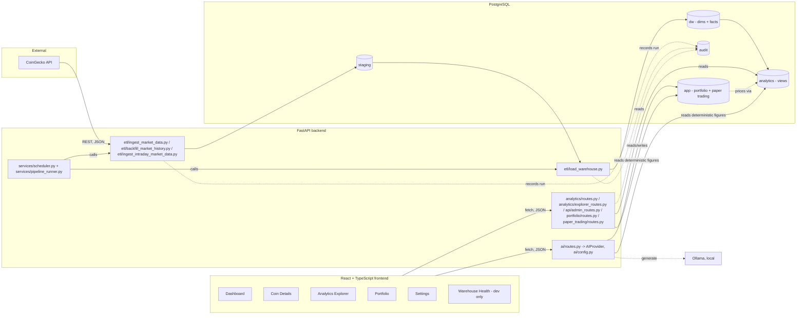

# Architecture

## System overview

## Layers

**Ingestion (`integrations/coingecko.py`, `etl/ingest_market_data.py`, `etl/staging_repository.py`).**
`integrations/coingecko.py` calls the CoinGecko markets endpoint and validates the response shape with a
Pydantic model (`CoinMarketData`), raising `CoinGeckoAPIError` for any network, HTTP, or shape
failure. `etl/ingest_market_data.py` wraps one ingest attempt in an `audit.etl_run` row
(`status='running'` → `'succeeded'`/`'failed'`) so every run is auditable regardless of outcome,
then hands the validated rows to `staging_repository.insert_market_snapshots`, which does a
single `executemany` insert into `staging.coingecko_market_snapshot`. Staging is append-only and
never mutated in place.

**ETL (`etl/load_warehouse.py`).** Loads exactly one staging batch (`run_id`) into the warehouse
per invocation. `select_batch` picks either an explicit `run_id` (must reference a `succeeded`
staging run) or the oldest `succeeded` batch that hasn't been loaded yet
(`audit.etl_run.loaded_at IS NULL`) — this is what makes repeated ETL invocations safe: a batch
already marked `loaded_at` is never reprocessed, so re-running the pipeline (e.g. after a crash,
or via the scheduler on its next tick) cannot double-count facts. Within one ETL run: `dim_date`
is upserted for the batch's snapshot date, `dim_coin` is upserted as a **Type 2 slowly-changing
dimension** (a changed symbol/name expires the old row and inserts a new one, keyed by the
partial unique index `dim_coin_current_uidx ... WHERE is_current`), and `fact_market_snapshot`
rows are inserted with `ON CONFLICT (date_key, coin_key) DO NOTHING` as a second, belt-and-braces
idempotency guard at the grain level. The whole batch runs inside one transaction — a failure
partway through rolls back everything and the `audit.etl_run` row for the ETL itself is marked
`failed`, leaving the source staging batch still eligible to be retried (`loaded_at` only gets
set on success).

**Historical backfill and intraday ingestion (`etl/backfill_market_history.py`,
`etl/ingest_intraday_market_data.py`, `services/startup_recovery.py`).** Two ingestion paths beyond the live
top-N pipeline: `etl/backfill_market_history.py` loads exact past calendar dates one at a time via
CoinGecko's `/coins/{id}/history` endpoint into `staging.coingecko_coin_history`
(`UNIQUE (coin_id, snapshot_date)`), and `etl/ingest_intraday_market_data.py` loads sub-daily
observations via `/coins/{id}/market_chart` into the separate `dw.fact_market_intraday` table (see
`DATA_WAREHOUSE_MODEL.md` for why it's a distinct fact table from the daily grain). Both are
idempotent and resumable, so an interrupted run just picks up whatever's still missing on retry.
`services/startup_recovery.py` runs a one-time gap check on FastAPI startup and kicks off a background
backfill for any missing days between the last loaded date and today.

**Scheduling (`services/scheduler.py`, `services/pipeline_runner.py`).** `pipeline_runner.run_pipeline` is the one
reusable entry point that chains ingest → ETL and updates a small in-memory state object
(`currently_running`, `last_success_at`, `last_failure_at`, `last_error_message`) consumed by
`/health/scheduler`. It's guarded by a `threading.Lock` (`acquire(blocking=False)`) so scheduled
and manual (`POST /admin/run-etl`) triggers can never run concurrently — a second call while one
is in flight raises `PipelineAlreadyRunningError` (surfaced as HTTP `409`) instead of queuing or
racing. `services/scheduler.py` wraps this in an APScheduler `BackgroundScheduler` interval job, started
and stopped from FastAPI's `lifespan` context manager, disabled by default via
`ENABLE_SCHEDULER=false` so tests and ad-hoc `uvicorn` runs never trigger network calls unasked.

**Analytics (`db/analytics/*.sql`, `analytics/repository.py`, `analytics/routes.py`).** All
read-side aggregation is pushed into SQL views over `dw`: `latest_snapshot` (one row per coin as
of `max(date_key)`) is the foundation view; `current_market_overview`, `top_market_cap`,
`top_volume`, and `market_history` all build on it. The API layer never joins `dw` tables
directly — it only ever selects from `analytics.*` views, keeping the star-schema join logic in
one place. `analytics/repository.py` is thin, parameterized SQL with no business logic;
`analytics/routes.py` owns HTTP concerns (status codes, query validation, response models).

**Portfolio (`portfolio/routes.py` → `portfolio/service.py` → `portfolio/repository.py`, plus
`app.portfolio` / `app.portfolio_holding`).** Same three-layer shape as analytics, with a service
layer in between because valuation is business logic, not a query. `coin_symbol` on a holding is
a **business key**, not a foreign key into `dw.dim_coin` — a holding must survive independently
of warehouse SCD2 churn, and current price/name are resolved at read time from
`analytics.latest_snapshot` (`analytics_repository.fetch_prices_for_symbols`), never persisted
and never fetched from CoinGecko directly. See [API.md](API.md) for the full endpoint reference
and the README's "Portfolio management" section for the valuation formulas.

**Analytics Explorer (`analytics/explorer_repository.py` → `analytics/explorer_service.py` →
`analytics/explorer_routes.py`).** A single warehouse query (`fetch_period_stats`, over
`analytics.market_history`) backs every interactive analysis — the service layer filters/sorts
those rows in Python per analysis type (increase/decrease by %/amount, top/bottom-N, rank change,
volatility) rather than issuing a bespoke SQL query per analysis. Purely deterministic; no AI
involved. See `ANALYTICS_GUIDE.md`.

**Paper Trading (`paper_trading/repository.py` → `paper_trading/service.py` →
`paper_trading/routes.py`, plus `app.paper_account` / `app.paper_transaction`).** Simulated
buy/sell against live warehouse prices from a configurable starting cash balance. Holdings and
weighted-average cost are never stored — they're derived by replaying a symbol's BUY/SELL rows in
execution order, so `app.paper_transaction` stays an honest, immutable audit trail.

**AI features (`ai/config.py` → `ai/provider.py` → `ai/ollama_provider.py`; `ai/market_summary_service.py`,
`ai/coin_analysis_service.py`, `ai/portfolio_review_service.py`; `ai/prompt_builder.py`;
`ai/routes.py`).** Every AI response separates deterministic figures (computed in plain Python from
`analytics_repository`/`paper_trading_service`, before the AI is ever called) from AI-authored
interpretation of those figures — the model never computes a number. Provider access is behind an
abstract `AIProvider` interface so swapping in a hosted provider later is a config change, not a
call-site change. See `AI_FEATURES.md`.

**Warehouse Health (`health/service.py` → `GET /health/warehouse`).** Aggregates
deterministic checks (DB connectivity, ETL run history, fact/dimension row counts, a duplicate-key
check, missing-date coverage via `startup_recovery.compute_missing_dates`, stale-coin detection,
scheduler status) into one response for the frontend's Warehouse Health page, each with a
Healthy/Warning/Error/Unknown status and a plain-English reason. Never returns secrets/connection
strings. The frontend page is a **developer/operations tool**: it is deliberately absent from the
user navigation and reachable only by direct URL (`/warehouse-health`); the backend endpoints are
a normal, fully supported part of the API.

**Frontend (`frontend/src/`).** `api/client.ts` centralizes `fetch`, JSON parsing, and error
normalization (`ApiError`) behind `apiGet`/`apiPost`/`apiPut`/`apiDelete`; `api/analytics.ts`,
`api/portfolio.ts`, `api/health.ts` are thin typed wrappers over specific endpoints.
`hooks/useApiData.ts` is the one data-fetching hook every page/section uses — it tracks its own
loading/error state and exposes `retry()`, so one failing section (e.g. the scheduler status
card) never blocks the rest of a page. Presentational components (`Table.css`-based tables,
`OverviewCards`, `MetricChart`) are shared across the dashboard and coin-details pages;
`SectionStatus` centralizes the loading/error/empty branching so every section renders those
three states identically.

Two cross-cutting frontend systems live outside the pages:

- **Theme (`theme/theme.ts`, `contexts/ThemeContext.tsx`)** — Light/Dark/System appearance.
  `ThemeProvider` resolves the preference (System reads `prefers-color-scheme` and subscribes to
  its `change` event), stamps `data-theme` + `color-scheme` on `<html>`, and persists to
  `localStorage` (`cmw-theme`). All colors flow from the CSS variables in `index.css`, which key
  off `:root[data-theme="dark"]` (with a `:root:not([data-theme])` media-query fallback for
  no-JS), so the entire app — charts included, since they use `var(--...)` for axes/tooltips —
  follows one variable set. An inline script in `index.html` applies the stored theme before React
  mounts to avoid a flash of the wrong theme.
- **Localization (`i18n/index.ts`, `i18n/en.json`, `i18n/mk.json`)** — `react-i18next` with
  English fallback. First launch detects the browser language (`mk*` → Macedonian); afterwards the
  `localStorage` choice (`cmw-language`) wins. `<html lang>` tracks the active language, and
  `utils/format.ts` derives its `Intl.NumberFormat`/`Intl.DateTimeFormat` locale from it, so
  numbers and dates re-format on language switch. A test enforces that `en.json` and `mk.json`
  contain the exact same key set.

## Data model

- **`staging`** — raw, append-only landing zone: `coingecko_market_snapshot` (live, one row per
  coin per ingestion run) and `coingecko_coin_history` (backfill, `UNIQUE (coin_id, snapshot_date)`).
- **`dw`** — `dim_date` (calendar), `dim_coin` (SCD2), `fact_market_snapshot` (daily grain,
  `UNIQUE (date_key, coin_key)`), `fact_market_intraday` (sub-daily grain,
  `UNIQUE (coin_key, observation_timestamp)`, deliberately a separate table from the daily fact —
  see `DATA_WAREHOUSE_MODEL.md`).
- **`audit`** — `etl_run`: one row per pipeline execution (ingest, backfill, intraday ingest, and
  ETL each get their own row), used for idempotency (`loaded_at`), the `/health/scheduler` /
  `/admin/run-etl` / `/health/warehouse` reporting.
- **`analytics`** — read-only views over `dw` (and, for `current_market_live` specifically,
  directly over `staging` — see `DATA_WAREHOUSE_MODEL.md`), described above. Nothing here is a
  table; every view is `CREATE OR REPLACE VIEW`, so it's safe to rerun.
- **`app`** — `portfolio`/`portfolio_holding` (manual holdings) and `paper_account`/
  `paper_transaction` (paper trading): application-owned data, never written to by the ingest/ETL
  pipeline, explicitly documented (`COMMENT ON SCHEMA`) as not part of the warehouse.

Full column/constraint detail lives in `db/*/*.sql` — the migration files are the source of
truth; this document intentionally doesn't restate every column. `database/bootstrap_db.py` applies them
idempotently via a `public.schema_migrations` ledger (each file runs at most once, tracked by
filename), so re-running it against an already-migrated database is a safe no-op.

## Request lifecycle (backend)

Every route depends on a per-request `_get_db()` generator (one in `analytics/routes.py`, one in
`portfolio/routes.py`) that opens a fresh `psycopg` connection via `database.get_connection()`
and uses the connection's own context-manager semantics (`with conn: yield conn`) to commit on a
clean return or roll back if an exception propagates. Only the *connect* call itself is wrapped
in a try/except that converts a failure into `503`; the `yield` is deliberately left unguarded so
that request-validation failures (which FastAPI throws into yield-dependencies during cleanup)
surface as their correct `422`/`400` instead of being misreported as `503`. See the docstring on
either `_get_db()` for the full explanation — this exact distinction was the subject of a bug
fixed during the production-readiness review (both routers now follow the same pattern).

There is no connection pool: each request opens and closes its own connection. This is a known,
accepted limitation for the app's current single-user/local scale — see
[KNOWN_LIMITATIONS.md](KNOWN_LIMITATIONS.md).

## Why these choices

- **In-process scheduler over a broker/queue.** The whole pipeline is a single blocking
  `requests` + `psycopg` call chain with no fan-out; APScheduler's `BackgroundScheduler` running
  in a `lifespan`-managed thread is enough concurrency control (`max_instances=1`, a run-level
  lock) without operating a second service.
- **Business-key linkage for portfolio holdings.** A foreign key into `dw.dim_coin` would tie a
  holding's lifetime to SCD2 row churn and break the moment a coin fell out of the tracked
  snapshot. Matching by symbol at read time keeps the two schemas decoupled while still
  resolving to live warehouse data whenever it's available.
- **Views, not materialized views, for analytics.** The dataset (top-N coins, daily grain) is
  small enough that plain views recompute cheaply on every request; materializing would add
  refresh-staleness to reason about for no measurable benefit at this scale.
